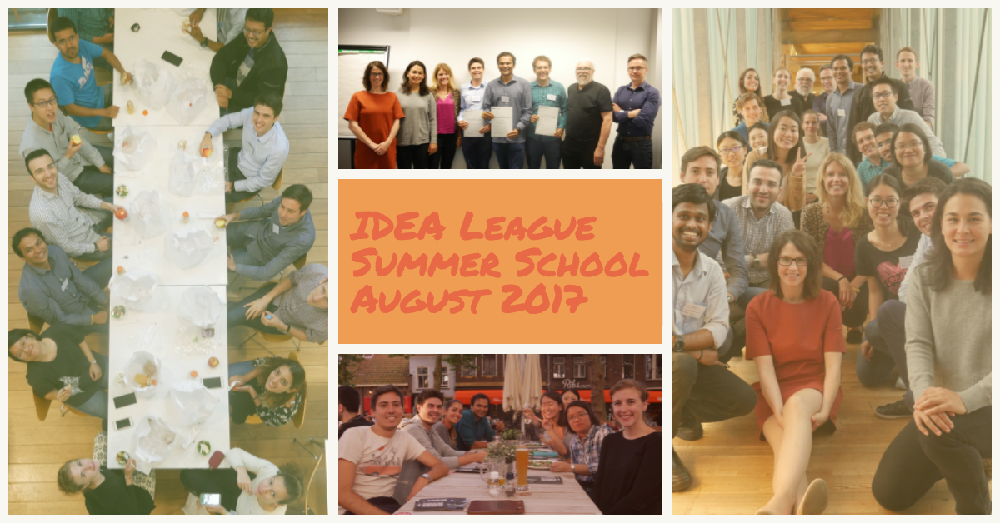

### Background
From 27–30th August, 2017, a summer school on “Responsible Robotics and AI” was hosted at the Technische Universiteit Delft.  [IDEA League Summer School](http://idealeague.org/summerschool/) is a collaborative summer programme for graduate students and PhDs of the respective member universities. The diverse group of participants included those from ETH Zürich, RWTH Aachen, Chalmers University of Technology, RWTH Aachen, Politecnico di Milano and TokyoTech.

### What was this summer school about, and why is it important?
The topic, i.e ***Responsible Robotics and AI*** is truly an inter-disciplinary amalgamation of topics such as psychology, robotics, ethics, design and computer science. As robots become more omnipresent and a significantly larger part of our personal lives, several ethical questions confront us as humans. The summer school tried to discuss and address these questions by stimulating the students not only with the latest academic research, but also with dialogues, conversations and productive group-activities.

### Who were the participants?
There were about 20 participants from IDEA League and ASPIRE League universities. Even more striking was the fact that the participants came from diverse and heterogeneous cultural backgrounds. There were participants from Italy, India, China, Vietnam, Portugal and Colombia to name a few. This ensured that the discussions always had different perspectives and it was extremely stimulating to think about various issues such as humanitarian aid, sex robots, robot laws from various points of view and appreciate the different factors involved in different situations. At the same time, there were friendly and informal discussions about different countries and their cultures, adding a whole new gamut of inter-cultural learning.

### What were the talks about?
Since the topic is highly inter-disciplinary, the talks were also designed to give us different perspectives of the topic. [Aimee Van Wynsberghe](https://www.tudelft.nl/en/tpm/about-the-faculty/departments/values-technology-and-innovation/people/assistant-professors/dr-a-aimee-van-wynsberghe/) from TU Delft introduced the topic and provided an essential treatment of ethics and embedded it into the subject of robotics. [Johanna Seibt](http://pure.au.dk/portal/en/persons/johanna-seibt(60a3d664-19f6-4fb6-9bde-625e6cee6f53).html) from Aarhus University talked about how to attribute responsibility in robotics. [Denise Soesilo](http://www.denisesoesilo.com/) and [Tina Comes](https://www.tudelft.nl/en/tpm/about-the-faculty/departments/multi-actor-systems/people/associate-professors/dr-tc-tina-comes/) talked about the use of robots in humanitarian aid. [Barry Fitzgerald](https://www.tudelft.nl/en/3me/organisation/organisation/departments/process-energy/people/intensified-reaction-separation-systems/barry-fitzgerald/) talked about taking inspiration from superhero movies to develop more advanced robotic technologies. [Noel Sharkey](http://staffwww.dcs.shef.ac.uk/people/N.Sharkey/) addressed the controversial issue of sex-robots, and the ethical issues involved with them.

### Was it all work and no play?

Not at all. The summer school featured talks and group activities from morning until 5 pm. But after that, the participants had time every day to interact among themselves and explore the wonderful city of Delft and The Hague. We made the best use of this time and got a taste of Dutch culture. The beautiful markets of Delft and street concerts on the weekend were very exciting. At the same time, we also had a chance to try the famous ‘Fries and Mayonnaise’, dutch cheese and other varieties of food. On one of the evenings, the organisers hosted a social dinner in which all the participants and speakers participated. This gave us an opportunity to have informal discussions not only among ourselves, but also with the speakers. The food was delicious as well. On the final day of the summer school, we had student presentations on innovative subjects within the realm of robot ethics. The presentations were uniquely creative, and was well-appreciated by everyone.