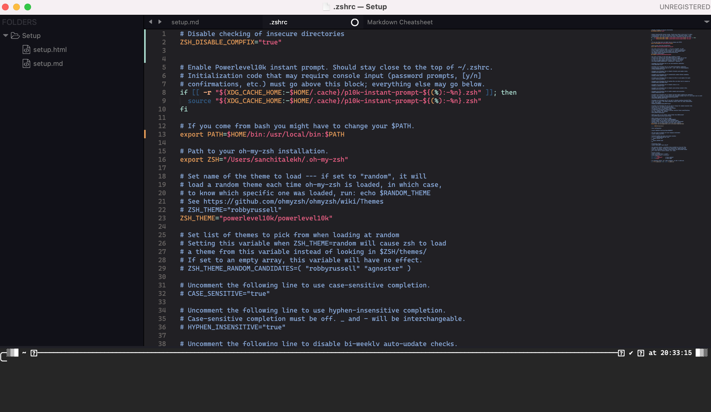

# Setting up a new computer

## Basics:

- Download [Sublime Text](www.sublimetext.com). Start with a tested UI/color-scheme combo of __Faarikal Dark__ and __BigBend__ (Colorsublime)
- Add the following config to Sublime Text after installing the fonts:

	```
	"font_face": "Cascadia Code",
	"font_size": 12
	```

- Symlink the `subl` command using `ln -s "/Applications/Sublime Text.app/Contents/SharedSupport/bin/subl" /usr/local/bin/subl`

- Install the Terminus package in Sublime to get a terminal inside Sublime (glyphs not supported atm).

- Download Mono/Powerline fonts, starting with [Cascadia Code](https://github.com/microsoft/cascadia-code/releases) and [Ubuntu Mono Powerline](https://github.com/powerline/fonts/tree/master/UbuntuMono)
- (Mac Only) Download apps from the App store and execute `xcode-select --install`

- At the end, sublime should look something like this:



## Terminal:

- (Mac only) Download [iTerm2](https://iterm2.com/downloads.html)
- Install zsh (already comes pre-installed on MacOS) and change the shell to zsh with `chsh -s $(which zsh)`
- Install __oh-my-zsh__: 

		`sh -c "$(curl -fsSL https://raw.github.com/ohmyzsh/ohmyzsh/master/tools/install.sh)"`

- Install __powerlevel10k__ : 


		`git clone --depth=1 https://gitee.com/romkatv/powerlevel10k.git ${ZSH_CUSTOM:-$HOME/.oh-my-zsh/custom}/themes/powerlevel10k`

- Set `ZSH_THEME="powerlevel10k/powerlevel10k"` in `~/.zshrc`.
- (Mac Only) Install __Homebrew__: 
	
	
	`/bin/bash -c "$(curl -fsSL https://raw.githubusercontent.com/Homebrew/install/HEAD/install.sh)"`

- Install the __zsh-z__, __zsh-autosuggestions__ and __zsh-syntax-highlighting plugins using the following commands and add the plugins to the list of plugins in `.zshrc`

	
	```
	git clone https://github.com/zsh-users/zsh-autosuggestions ${ZSH_CUSTOM:-~/.oh-my-zsh/custom}/plugins/zsh-autosuggestions
	git clone https://github.com/agkozak/zsh-z $ZSH_CUSTOM/plugins/zsh-z
	git clone https://github.com/zsh-users/zsh-syntax-highlighting.git ${ZSH_CUSTOM:-~/.oh-my-zsh/custom}/plugins/zsh-syntax-highlighting
	```

## Personal Website:

- Clone the [repo](https://github.com/salekh/salekh.github.io) and follow the instructions on the [Poole](https://github.com/poole/poole) webpage to serve up a Jekyll page.
- Once this is done, `jekyll serve` should generate the html files and serve up the website locally.


